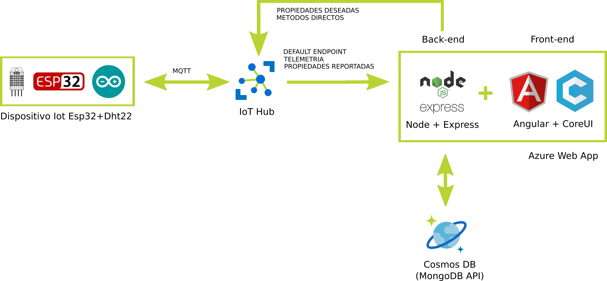

Autor: Martín González - 2020

# Monitoreo de Temperatura y Humedad con ESP32

## Introducción

El objeto de este proyecto es finalizar la asignatura Desarrollo de Aplicaciones para IoT de la CEIoT.

La aplicacion desarrollada puede accederse desde:
https://giemonitoring.azurewebsites.net

## Descripción General

En la siguiente figura se muestra el esquema general de la aplicación

El dispositivo Esp32 adquiere cada 1 minuto los datos de temperatura y humedad de un sensor Dht22. Los datos junto con su timestamp son transmitidos al IoT Hub en Azure. 

La aplicación backend desarrollada en Node y Express suscribe al endpoint del IoT Hub y recibe los datos. Los datos son almacenados en la base de datos CosmosDB (Api Mongo). Tambien provee la API para realizar operaciones CRUD sobre la base de datos (clientes, proyectos, usuarios, dispositivos, datos). Adicionalmente funciona como servidor Http para el frontend.

El frontend está desarrollado en Angular en base a la plantilla CoreUI. Al iniciar abre un socket en el backend para recibir los datos del dispositivo en tiempo real.

Ambas aplicaciones se enuentran hosteadas en el servicio Azure App (Linux), aunque podrian funcionar facilmente en un contenedor docker y/o utilizar MongoDB coo base de datos.